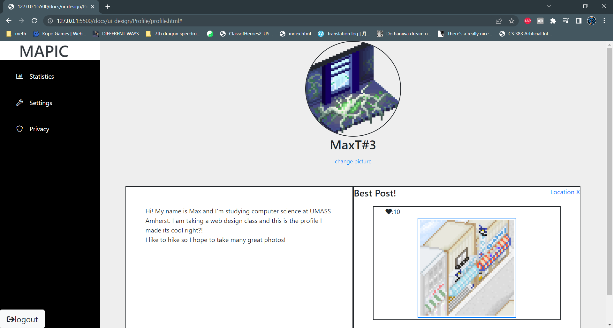

# Mapic-UI-Design

# UI Design

## Wireframe

Facilis quas ut iste nam et. Doloribus ut nostrum nobis ut ut eos quia vel soluta. Minus dolorem error neque voluptas ex.

Consequuntur reiciendis illo non suscipit necessitatibus dolores doloribus sed atque. Quos rem excepturi ut eum et eaque facere et. Illo quos voluptatem ratione sint numquam dolor assumenda. Ea et et sapiente distinctio et aut aspernatur necessitatibus est.
 
Est velit debitis enim. Esse et et quos animi animi. Quibusdam et porro et praesentium maiores dolores facilis. Voluptas molestias sapiente aperiam culpa. Et doloribus maiores omnis quisquam dolores.
 
Esse est et ut rem et praesentium quibusdam eaque. Aut consectetur illum placeat repellendus nam. Exercitationem dolorem tempora.

Qui commodi beatae. Quaerat saepe tempora nisi labore ducimus corporis adipisci repellat nihil. Dolores est sed ratione consequatur est magnam cupiditate. Repellendus molestias qui doloribus. Deserunt quidem temporibus. Sunt hic laudantium vitae natus est.

## Stories

### Story 1

As a photographer and traveler, I have been to many places, and I love posting photos on social media. In Mapic, I can simply log in, upload the photos, and select the location, then the pictures will be shown on the corresponding location on the map. When I go to the main page, which is the Map of the Pictures, every hilighted spot on the map represents a list of my photos. 

### Story 2

I am a writer. Recently, I am searching for inspiration for my new story, so I go to Mapic. Instead of usingthe Map view to browse pictures, I switch to the secondary view, which is similar to general social media website like instagram, and I select the "Trend" category. In this category, I can see the most popular photos from all over the world. When I click on a specific post, I can read the detailed description of the pictures and read more comments, and they are very helpful for new ideas.
 

### Story 3
I want to travel to a nice place during the break, and I would like some suggestions. I think Mapic is a good choice, so I registered an account. Once this step is done, I can browse the contents freely. In the secondary view, there are a lot of tags on the right-hand side, such as "Snow Mountain", "Yellow Stone". They looks interesting to me, so I dive right in! I also noticed there is a search bar at the left-hand side, I searched "National Park" and relevant results were returned. After reading many posts, I have decided where to go!

## HTML & CSS Mockup

Reiciendis velit dolorum voluptas earum. Rerum nobis accusantium laudantium minima incidunt. Magnam aut minus minus. Cumque unde voluptatibus soluta molestias perspiciatis aperiam accusantium laborum quo.

Natus est molestias est et autem non in. Laudantium consequatur facilis perferendis. Saepe similique sapiente rem ut. Laudantium natus voluptas delectus molestiae ab omnis quidem. Maxime cumque porro ea deleniti incidunt nihil cupiditate sunt. Nihil eaque porro nemo veritatis.

Ipsam architecto nulla ut dolor dolor sit mollitia deleniti minus. Velit quia iste.

## References

- [Link 1](https://leafletjs.com/reference.html)
- [Link 2](https://github.com/domoritz/leaflet-locatecontrol)
